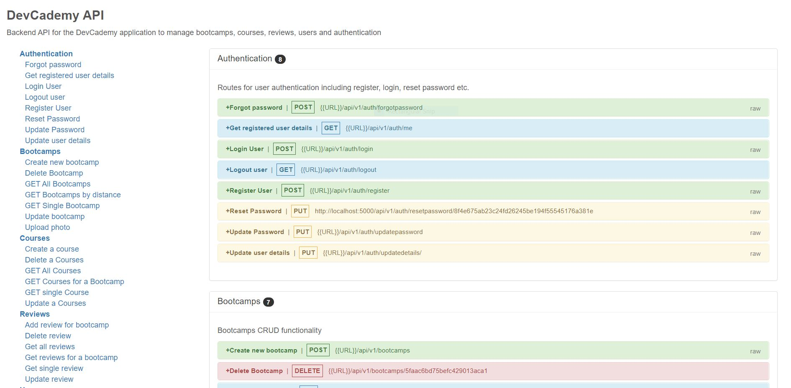
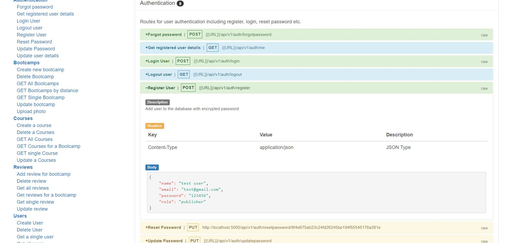

# DevCademy API
> Backend API for DevCademy application, which is a bootcamp directory website





## Tech Stack

NodeJS, ExpressJS, MongoDB, mongoose, bcryptjs, cookie-parser, cors, express-fileupload, express-mongo-sanitize, express-rate-limit, helmet, jsonwebtoken, node-geocoder, nodemailer, slugify, xss-clean

## Usage

Rename "config/config.env.env" to "config/config.env" and update the values/settings to your own

## Install Dependencies

```
npm install
```

## Run App

```
# Run in dev mode
npm run dev

# Run in prod mode
npm start
```

## Database Seeder

To seed the database with users, bootcamps, courses and reviews with data from the "\_data" folder, run

```
# Destroy all data
node seeder -d

# Import all data
node seeder -i
```
